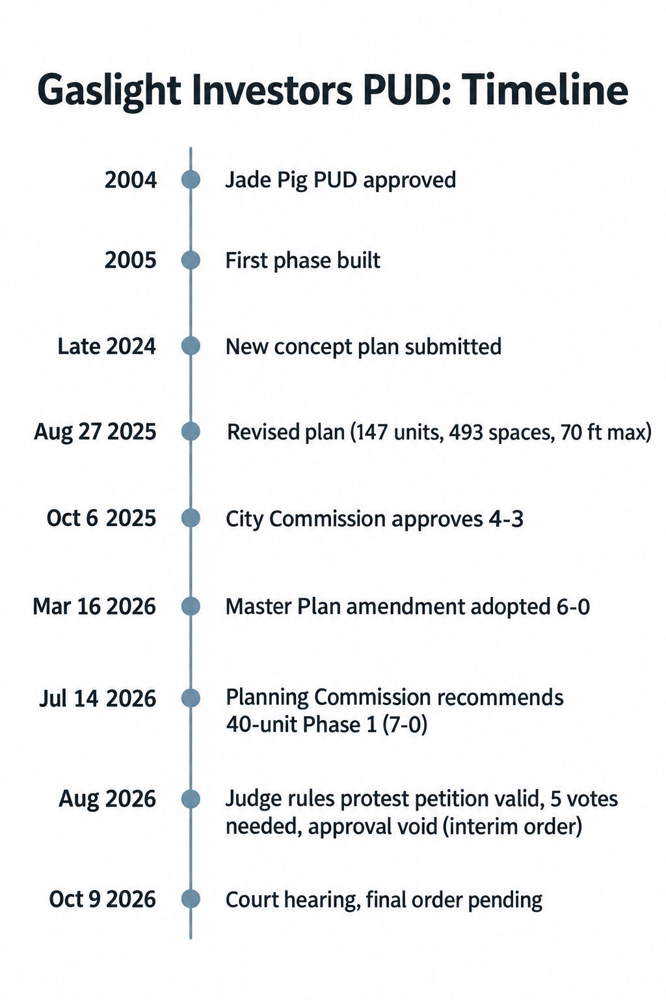

> **Correction / clarification (added Oct 9, 2026):** Someone reported that the city's PUD document shows 166 units, not 147. Checking the documents: **166 comes from the original proposal.** The May 3, 2024 concept plan (in the June 11, 2024 Planning Commission introduction packet, memo dated June 6, 2024; https://www.eastgrmi.gov/DocumentCenter/View/4188) lists "166 new residential units" plus 14 townhomes, which is 180 total (583 parking spaces). Later versions: March 21 and April 16, 2025 concept plans: 149 (132 + 17 townhomes). Revised PUD amendment memo (dated July 14, 2025) and its exhibit: "149 to 151". July 2025 FAQ table: "141 to 151". **Aug 27, 2025 revised concept plan: 147 (130 + 17 townhomes)**, the version approved Oct 6, 2025 and listed on the city page. 147 is the current figure. 166 does not count existing units; Buildings A and B are commercial. One clarification: the PUD memo itself shows 149–151, not 147.

# Joint summary (Grok, Codex, Claude), as of Oct 9, 2026

**The project.** Gaslight Investors wants to finish the long-stalled 8.6-acre "Jade Pig" PUD site at 2255 Wealthy St / 515 Lakeside Dr SE. The plan is 147 homes (130 units plus 17 townhomes), 493 parking spaces, about 32,000 sq ft of new commercial space, and a 70 ft maximum height (the 2004 plan reached about 94 ft). The new structures are 2 mixed-use buildings, 3 residential buildings and a garage, next to existing buildings A and B. About 10% of units are proposed as "attainable" rentals at 100–120% of Kent County AMI, with no final commitment yet.

**Legal status.** The City Commission approved the concept plan 4–3 on Oct 6, 2025. In August 2026 Kent County Circuit Judge George Quist ruled the residents' protest petition valid, so 5 votes were needed, and he voided that vote. This is an **interim order**. A hearing was set for **today, Oct 9**, and its outcome is not public in our sources. Once a final order is entered, either side has **21 days to appeal**. The city's outside counsel is weighing an appeal focused on the clerk's duty to verify petition signers. The city attorney says the application is still pending and the preliminary PUD-agreement/site-plan approval survives. The Mayor said Sept 21 that "the project is not moving forward." Separately, the Planning Commission recommended a 40-unit Phase 1 by 7–0 on July 14, 2026, and the City Commission never acted on it.

**Master Plan 2026.** It was **adopted** 6–0 by the City Commission on March 16, 2026; a staff memo says "April 2026". The prior research said it was not enacted, which is wrong. It is guidance only: extend multifamily zoning along Wealthy to Rosewood, add housing options at St. Stephen, and redevelop Gaslight Plaza (owner-dependent). No rezoning has happened. At the Sept 15 study session the Planning Commission's top-5 priorities were nonconforming lots, accessory buildings, Plaza redevelopment, reducing nonconformities and administrative departures. Wealthy multifamily and St. Stephen housing were **not** in the top 5.

**For / against.** For: it fills a site vacant for about 20 years, adds housing variety and some commercial space, follows the plan's housing goal, is shorter than the 2004 plan, and the City is not obligated to pay for infrastructure. Against: scale, traffic and parking concerns, a "attainable" tier at 100–120% AMI that is still costly, unfunded infrastructure that could force plan changes, and a process the court found legally defective.

**Watch next.** The Oct 9 ruling and final order, then the 21-day appeal clock. Also watch CC agendas for closed sessions or appeal votes, any re-vote (5 needed), the restored city web page, the Nov 10 PC meeting, and any zoning amendments implementing the plan. The Oct 13 PC has only a through-lots study session.

**Where the models disagreed:**
- Building count: Grok repeated the city page's "six (1+3+3)"; the drawings support 2 mixed-use + 3 residential + garage.
- What survives the ruling: Claude said "2004 approvals"; Codex and Grok said only the preliminary PUD agreement/site plan.
- City funding: Claude said the City "doesn't have to pay"; Codex and Grok said it is not obligated but may pay voluntarily.
- Claude treated $79,756 median income as AMI and used an outdated density (17.5 vs ~17.1/ac).
- Grok was unsure of the Phase 1 date (confirmed July 14) and of the April adoption date (unexplained).

---

## Method and models
Each model wrote its memo independently from `sources/`, then read all three memos and replied once. Models: Grok (Grok Bot), Codex CLI 0.162.0 (`gpt-6.1-sol`, reasoning effort high, read-only), and Claude Code 2.1.295 (`claude-opus-5-5`). Not verified: ADUs legal since Feb 2024 (not in these sources).

## Image test
Codex CLI 0.162.0 has the `image_generation` feature (stable, enabled). In exec mode it produced `gaslight_timeline.png` with its built-in image tool, not code. The timeline text was checked against the sources.

---

## What residents are saying
See [facebook-sentiment.md](facebook-sentiment.md). It was compiled by Muse from posts in three EGR Facebook groups (Apr 2025 to Oct 2026). It is paraphrased, contains no names, is not verified, and post links are withheld.
- **Concerns:** scale and height out of character with the village; broken promises from the 2004 PUD (the parking deck was demolished) and process complaints, which the August ruling seemed to vindicate; Brownfield/TIF incentives (a "$20M+" figure is unsourced); traffic and parking near schools; lack of green space.
- **Support:** the site has been an eyesore for 20 years; private property rights; tax base and business revitalization; housing diversity; the plan has already shrunk (7 to 5 stories).
- **After the ruling:** ideas for a "Village Green" or city purchase of the lots, against "it's private property."
- **Gap:** no detectable Facebook discussion of the 2026 Master Plan housing changes (Wealthy toward Rosewood, St. Stephen, Gaslight Plaza) in 18 months.

---

# Grok memo
# Grok memo: Gaslight Investors PUD and EGR Master Plan 2026
(Sources: sources/ folder. Inferences marked [inference].)

## What's proposed
- Gaslight Investors PUD amendment on 8.6 acres at 2255 Wealthy St / 515 Lakeside Dr SE (remainder of the 2004 "Jade Pig" PUD; one phase built in 2005). Six buildings: 1 parking structure, 3 mixed-use, 3 residential; 147 units (condos, apartments, townhomes); 493 parking spaces; tallest building 70 ft (down from 94 ft). About 10% of units proposed as attainable rentals at 100–120% of Kent County AMI (city page/FAQ).
- Phase 1: final site plan for 40 residential units at 515 Lakeside, plus a revised PUD agreement, recommended by the Planning Commission (Aug 17, 2026 CC packet; WGVU). The prior pass said July 14, 2026; that matches the PC agenda date, but I could not open the minutes to confirm it.
- Master Plan Amendment 2026: subarea plan. It proposes extending MFR zoning along both sides of Wealthy to Rosewood, more housing in the St. Stephen neighborhood, and redeveloping Gaslight/D&W Plaza (owner-dependent concept sketches). Goal: "increase opportunities for housing variety and attainability."

## Status and legal
- Concept plan approved 4–3 on Oct 6, 2025. Kent County Circuit Judge George Quist ruled that the residents' protest petition (~1,500 signers, per WGVU) was valid, so 5 votes were needed and the Oct 6 vote is void (Aug 2026).
- Sept 15, 2026 PC minutes (in the Oct 13 packet): the ruling was an **interim order, with no final order yet**. The next hearing was set for **Oct 9, 2026**. The 21-day appeal window starts when the final order is entered, and the city and the developer could each appeal. The city attorney said the ruling only throws out the Oct 6 vote: "there is still a pending application," and the preliminary PUD/site plan approval "is still in place because the ordinance did not expire." [This contradicts the earlier "no project before the city" framing; the city page says the developer has not said how or if it will proceed.]
- Oct 5, 2026 CC packet (Sept 21 minutes): outside counsel Mike Roth discussed a dismissal that preserves "pathways for both parties to appeal." His appeal focus is the clerk's duty to verify petition signers (for example trusts and LLCs). The commission voted 7–0 to restore the Gaslight Investors page on the website.
- Master Plan: **adopted**. The City Commission voted 6–0 on March 16, 2026 (with page 9 charts and the Gaslight example on page 10 removed). PC staff memo: "approved in April 2026" (the PDF was last modified Apr 14, 2026). [inference: CC adoption in March, final document/PC step in April.] A master plan is guidance only; no rezoning has been enacted.
- Sept 15 PC study session: the top 5 priorities were nonconforming-lot flexibility, R-2/R-3 accessory buildings, redeveloping the Plaza, reducing nonconformities, and administrative departures. Wealthy MFR and St. Stephen housing did **not** make the top 5. Commissioners noted the Plaza is "in lockdown for the next several years."
- ADUs legal since Feb 2024: not verified in these sources.

## Key numbers
147 units / 6 bldgs / 8.6 ac / 493 spaces / 70 ft / ~10% at 100–120% AMI / 4–3 vote vs 5 needed / Phase 1 = 40 units / ~1,500 petition signers / 6–0 master plan vote.

## Strongest case for and against
- For: infills a site vacant for about 20 years. Adds housing variety and some attainable units, in line with the adopted plan's housing goal. Adds parking for the district. Height was cut from 94 to 70 ft.
- Against: scale and height next to homes, traffic and parking, a thin affordability share at 100–120% AMI, and a process ruled to have violated the supermajority requirement.

## Open questions
Outcome of the Oct 9 hearing and the final order; whether the city or the developer appeals; whether the 4–3 vote is retaken or needs 5; the status of Phase 1 final site plan approval.

## What to watch
Final order and the 21-day appeal clock; the Oct 13 PC (master plan priorities); any CC re-vote; zoning amendments drafted from the master plan.

---

# Codex memo
## What is proposed

Gaslight Investors’ revised PUD would add housing, commercial space and a parking garage at 2255 Wealthy Street/515 Lakeside Drive, an 8.6-acre site. The August 2025 drawing removes Building E and shows two new mixed-use buildings, three residential buildings and a garage; existing buildings A/B remain. This differs from the city webpage’s building summary. (city_page.txt; Aug-27-2025-Revised-Gaslight-Investors-Concept-Plan.txt)

The 2026 Master Plan recommends more housing choice and attainability, extending multifamily zoning along both sides of Wealthy east to Rosewood, potential housing/reuse at St. Stephen, and more flexible rules for nonconforming lots. These require subsequent zoning actions; the redevelopment illustrations are options. (master_plan_2026.txt)

## Status and legal

**As of October 9, 2026:** the October 6, 2025 concept approval passed 4–3, but a judge invalidated that vote because residents’ valid protest petition required five affirmative votes. (city_page.txt; fox17.txt)

September 15 minutes report an interim order, an October 9 hearing, and a 21-day appeal window beginning when a final decision is entered. Attorney Huff said the application remained pending and preliminary PUD agreement/site-plan approval survived, with final site-plan approval still required. September 21 city minutes nevertheless describe this version as not moving forward. The supplied files contain no October 9 hearing outcome. (agendas/Agenda__10132026-961.txt; agendas/Agenda__10052026-960.txt)

The 2004 PUD remains relevant; the FAQ says it remains effective unless amended. **[inference]** The webpage’s older “final plan stage” language should not be treated as current authorization. (FAQs-Document.txt; city_page.txt)

March 16 minutes record Master Plan adoption, 6–0, with specified edits; September staff materials instead say April 2026. (agendas/Minutes__03162026-928.txt; agendas/Agenda__09152026-956.txt)

## Key numbers

- **147 homes:** 130 units plus 17 townhomes; **493 parking spaces**; **32,000 square feet** of new commercial space. Earlier proposal: 180 homes and 583 spaces. (Aug-27-2025-Revised-Gaslight-Investors-Concept-Plan.txt)
- **70-foot maximum height**, versus approximately **94 feet** to the original plan’s roof peak. (FAQs-Document.txt)
- Approximately **10%** of homes proposed as attainable rentals, with rents based on **100–120% of Kent County AMI**; final commitments remain unresolved. (city_page.txt)
- Planning Commission recommended a **40-unit Phase 1**, 7–0, before the court ruling; that was a recommendation to City Commission. (agendas/Agenda__08172026-953.txt)

## Strongest case for and against

**For — [inference]:** More housing types could help residents remain in EGR and support village businesses. The Master Plan survey found over one-quarter would choose something other than a single-family home. The revised project also reduces units, commercial area and building scale compared with its earlier proposal. (master_plan_2026.txt; Aug-27-2025-Revised-Gaslight-Investors-Concept-Plan.txt)

**Against — [inference]:** Traffic, pedestrian conflicts, parking and building scale warrant scrutiny before approval. These are documented community concerns; proposed attainable rents do not establish that lower-income households could afford the homes. Infrastructure funding also remains consequential: draft conditions allow voluntary city participation while requiring plan changes if necessary improvements lack funding. (master_plan_2026.txt; city_page.txt; Revised-PUD-amendment-memo.txt)

## Open questions

What survives the final court order? Will either party appeal, or will the developer revise the proposal? What are final rents, ownership mix, bedroom counts, infrastructure costs and funding commitments? Which building summary governs? These remain unsettled or inconsistent in the supplied records. (agendas/Agenda__10132026-961.txt; city_page.txt; Revised-PUD-amendment-memo.txt)

## What residents should watch for next

Watch for today’s court outcome, entry of a final order, any appeal and the developer’s response. October 13’s Planning Commission agenda lists a through-lots study session, not a PUD approval. Monitor separate zoning proposals implementing the Master Plan; September priorities emphasized nonconforming lots, setbacks and plaza redevelopment. (agendas/Agenda__10132026-961.txt)

---

# Claude memo
# Gaslight Investors PUD and the 2026 Master Plan: Resident Memo (as of Oct 9, 2026)

*Source key: CITY = city_page.txt; CP = Aug-27-2025-Revised-Gaslight-Investors-Concept-Plan.txt; FAQ = FAQs-Document.txt; MEMO = Revised-PUD-amendment-memo.txt; MP = master_plan_2026.txt; A-date = agendas/Agenda__[date].txt; M-date = agendas/Minutes__[date].txt; FOX = fox17.txt; WGVU = wgvu.txt*

## What is proposed
- **Gaslight PUD:** Gaslight Investors would build on the unfinished 8.6-acre site at 2255 Wealthy St. and 515 Lakeside Dr. It was approved in 2004 as the "Jade Pig" PUD, but only the first phase was built (CITY). The Aug 2025 plan adds two mixed-use buildings (C, D), three residential buildings (F, G, H) and a parking structure (CP).
- **Master Plan amendment:** It adds to the 2018 plan. Its goal is "a variety of housing options… at an attainable cost" (MP). The zoning plan would extend multi-family (MFR) zoning east along Wealthy St. to Rosewood. It also suggests possible housing at St. Stephen and more flexibility for nonconforming lots (MP). It calls changes in the Greenwood neighborhood "premature" (MP).

## Status and legal
- On Oct 6, 2025 the City Commission approved the concept plan 4–3. A Kent County judge then ruled the residents' protest petition valid, which meant 5 votes were needed, so the vote is void (CITY, FOX, WGVU).
- The judge's order is interim. A further hearing was set for **today, Oct 9**. Once a final order is entered, either side has 21 days to appeal, and an appeal "could easily be 2 years" (A-10132026, Sept 15 PC minutes). None of these files say how today's hearing went.
- The City Attorney said the ruling only throws out the Oct 6 vote. The application is still pending, and the 2004 approvals remain in place (A-10132026). The opposing group says a "new and substantially different plan" is needed (WGVU).
- The Mayor said "the project is not moving forward" (A-10052026, Sept 21 minutes). The developer has not told the City what it plans to do (CITY).
- The Planning Commission voted 7–0 to recommend a Phase I final plan for 40 units at 515 Lakeside (A-08172026, July 14 PC minutes). These files show no City Commission action on it.
- The City Commission adopted the Master Plan on Mar 16, 2026 after removing a Gaslight Investors example (M-03162026). A later staff memo says it was approved "April 2026" (A-09152026).

## Key numbers
| Item | Value |
|---|---|
| Units | 147 (17 townhomes + 130 units) (CP) |
| Parking | 493 spaces (CP) |
| Commercial | 109,500 sf (77,500 existing + 32,000 new) (CP) |
| Tallest | 70 ft, 5 stories; the 2004 plan reached about 94 ft (CITY, FAQ) |
| 2004 plan | 107 condos, 687 spaces (FAQ) |
| Attainable units | About 10% of units, with rents at 100–120% of Kent County AMI (CITY) |
| Density | 17.5 units/acre for the full site; Croswell Mews is 19.8 (FAQ, July 2025 version) |
| EGR housing | Median value $502,000; 94.3% owner-occupied; 6% of homes built since 2000 (MP) |

## Strongest case for and against
- **For:**
  - It matches the Master Plan's housing goal (MP).
  - 26.5% of survey respondents would choose something other than a single-family home (MP).
  - It is shorter than the 2004 plan (FAQ).
  - It adds commercial space residents have asked for (MP).
  - The City does not have to pay for street or utility upgrades (MEMO).
- **Against:**
  - Opponents call it "too big for the amount of area" (FOX).
  - There are concerns about traffic and parking and about missing studies (A-08172026; MP).
  - Design details are still unknown (CITY).
  - [inference] Kent County AMI is $79,756 against EGR's $168,487 (MP), so the "attainable" rents may still be fairly high.

## Open questions
- What happened at today's hearing, and will the City or the developer appeal? The City's lawyer has pointed to concerns about the clerk's duty to verify petition signers (A-10052026).
- What is the status of Phase I? An easement issue must be resolved before building permits are issued (A-08172026).
- Can the developer build under the 2004 approvals? A commissioner said the PUD "reverted back to the 2004 version" (A-09212026, Sept 8 minutes).
- Will there be a Brownfield or TIF request (FAQ)?
- The City page still says the project is in the "final plan stage," and the Master Plan still calls the concept "approved" (CITY, MP). Will these be updated?
- Files disagree on facts:
  - The City page says "six" buildings but lists seven types (CITY).
  - The Master Plan gives median home value as both $502,000 and $500,200 (MP).
  - WGVU says 1,500 signers, while FOX describes the legal test as owners within 100 ft (WGVU, FOX).

## What residents should watch for next
- **Final court order:** this starts the 21-day appeal window. [inference] If the order is entered around now, appeals would be due in late October or early November.
- **City Commission agendas:** watch for closed sessions on the case, appeal votes and any Phase I item.
- **Restored Gaslight Investors web page:** approved 7–0 (A-10052026).
- **Planning Commission Master Plan priorities:** the top 5 do not include the "housing variety" item (A-10132026). The next PC meeting is Nov 10, 2026 (A-10132026).
- **Zoning changes:** any MFR rezoning along Wealthy or proposals for Gaslight Plaza (MP).

---

# Discussion
## Grok reply (discussion round)
**Agreements:** the core numbers, the void 4–3 vote, the interim order with no final order, Oct 9 hearing outcome not in the files, and Master Plan adoption 6–0 on Mar 16, 2026.
**Corrections I accept:**
- (1) Building count. It is six *new* structures (mixed-use C and D, residential F/G/H, a garage) alongside the existing A/B. The city page's "three mixed-use" is wrong.
- (2) Phase 1. Confirmed: July 14, 2026, 7–0 (July 14 PC minutes in the Aug 17 CC packet).
- (3) Oct 13 PC agenda. The scheduled study session is through lots. The master-plan priority list is in the attached Sept 15 minutes, not a new agenda item.
- (4) Adoption date. My "April = PC/final step" explanation is unverified. The documented adoption is Mar 16; "April 2026" appears only in a staff memo.
**Disagreements with Claude:**
- "2004 approvals remain in place" overstates what the city attorney said. His statement was that the *preliminary approval for the PUD agreement and site plan* survives.
- The $79,756 figure is median household income, not the AMI used for rent-setting.
- Density is 147/8.6 ≈ 17.1 units/acre; 17.5 came from an older FAQ.
- The City "is not obligated" to fund upgrades but may do so voluntarily.
**Added nuance:** the attorney's "pending application" and the Mayor's "not moving forward" (Sept 21) are both on record. Their practical meaning is unresolved [inference].

---

## Codex reply
**Agreements**

All three agree on 147 homes, 493 parking spaces, a 70-foot maximum height, and roughly 10% proposed attainable rentals at 100–120% of Kent County AMI. The Master Plan supports housing variety, Wealthy-to-Rosewood multifamily zoning, and possible St. Stephen reuse; implementation requires further action. ([City page](sources/city_page.txt), [Master Plan](sources/master_plan_2026.txt))

All report the invalidated 4–3 approval, an interim order, unresolved appeals, and no supplied October 9 hearing outcome. ([September 15 minutes](sources/agendas/Agenda__10132026-961.txt:150))

**Disagreements**

- **Building count:** Grok repeats the webpage’s inconsistent “six” buildings while listing seven. Codex and Claude correctly follow the August drawing: **six new structures**—two mixed-use, three residential, one garage—plus existing A/B; E was removed. ([Concept drawing](sources/Aug-27-2025-Revised-Gaslight-Investors-Concept-Plan.txt:4))
- **October 13 business:** Grok implies Master Plan priorities are upcoming; Codex correctly identifies **Through Lots** as the scheduled study session. The priority discussion appears in attached September minutes. ([October 13 agenda](sources/agendas/Agenda__10132026-961.txt:22))

**Corrections**

- **Adoption date:** March 16 adoption, 6–0, is documented. September staff’s “April 2026” conflicts with that record; Grok’s proposed April finalization/Planning Commission explanation remains unverified. ([Adoption minutes](sources/agendas/Minutes__03162026-928.txt:103))
- **Phase 1:** July 14 is verified: the Planning Commission recommended the 40-unit plan **7–0**, subject to City Commission approval. Grok’s uncertainty is unnecessary. ([July 14 minutes](sources/agendas/Agenda__08172026-953.txt:1621))
- **Legal status:** Counsel described a pending application and surviving preliminary approvals; later officials said this version was not moving forward. These statements concern different aspects of status and do not establish final construction authorization. ([September 15](sources/agendas/Agenda__10132026-961.txt:163), [September 21](sources/agendas/Agenda__10052026-960.txt:1451))
- **Funding:** Claude’s “does not have to pay” accurately describes draft conditions, but voluntary city funding remains permitted; unfunded necessary improvements require plan changes. ([PUD memo](sources/Revised-PUD-amendment-memo.txt:80))
- **Income/density:** Claude labels $79,756 “AMI,” but the table identifies **median household income**, not the project’s rent-setting benchmark. Its 17.5 units/acre comes from the earlier July FAQ; 147 ÷ 8.6 is approximately **17.1**. ([Master Plan](sources/master_plan_2026.txt:156), [FAQ](sources/FAQs-Document.txt:1897))
- **Petitions:** Claude’s claimed conflict compares total reported signers with eligibility/threshold criteria; those are different measures. ([WGVU](sources/wgvu.txt), [FOX17](sources/fox17.txt))

---

## Claude reply
## Agreements
- **Site and program:** 8.6 acres at 2255 Wealthy / 515 Lakeside; 147 units; 493 parking spaces; 70 ft max height (the original plan was ~94 ft); ~10% attainable rentals at 100–120% of Kent County AMI.
- **Vote:** The 4–3 concept approval on Oct 6, 2025 is void because the court found the protest petition valid, which meant 5 votes were needed.
- **Court status:** The judge's order is interim. A hearing was set for today, Oct 9, and the 21-day appeal window opens once a final order is entered. None of the files say how today's hearing went.
- **Master Plan:** The City Commission adopted it 6–0 on Mar 16, 2026, but a later staff memo says "April 2026." The plan is guidance only; no rezoning has been enacted.
- **Phase 1:** The Planning Commission recommended a 40-unit Phase 1 by 7–0.

## Disagreements
- **Building count:** Grok repeats the city page's "six buildings" but lists 1 + 3 + 3 = 7. Codex and Claude follow the concept plan instead.
- **What survives the ruling:** Claude says the "2004 approvals remain in place." Codex and Grok quote the narrower statement that the preliminary PUD agreement and site-plan approval are still in place.
- **City funding:** Claude says the City doesn't have to pay for street or utility upgrades. Codex says the City may choose to help pay, and the plan must be cut back if upgrades aren't funded.
- **Phase 1 date:** Grok wasn't sure it was July 14.

## Corrections
1. **Buildings:** The project adds six new buildings to the existing A and B: mixed-use C and D, residential F, G and H, and a two-level garage. Building E was dropped. That is two mixed-use buildings, not three (`Aug-27-2025-Revised-Gaslight-Investors-Concept-Plan.txt`). The city page's "three mixed-use" figure is wrong (`city_page.txt`).
2. **Phase 1 date:** Confirmed as July 14, 2026, 7–0, before the Aug 7 court date. The revised PUD agreement replaces the 2005 agreement, and the easement must be resolved before building permits are issued (`agendas/Agenda__08172026-953.txt`).
3. **What survives:** City Attorney Huff said "the preliminary approval for the PUD agreement and site plan is still in place because the ordinance did not expire," and final site-plan approval is still required. He never says "2004." That phrase comes from a commissioner at the Sept 8 meeting (`agendas/Agenda__10132026-961.txt`; `agendas/Agenda__09212026-957.txt`).
4. **Funding:** The City "is not obligated to fund" upgrades but may fund them voluntarily. If needed upgrades aren't funded, the final plan must be changed (`Revised-PUD-amendment-memo.txt`, conditions 4–5).
5. **"Not moving forward":** At the Sept 21 meeting, the Mayor said "the project is not moving forward," and Commissioner Skaggs said "this version is not moving forward." Both quotes appear in the Sept 21 minutes inside the Oct 5 packet (`agendas/Agenda__10052026-960.txt`).
6. **Planning Commission priorities:** The top 5 include "Redevelop Shopping Center Plaza," while commissioners said that topic is "in lockdown for the next several years." Housing variety, Wealthy multifamily and St. Stephen did not make the list. The Oct 13 agenda has only a through-lots study session, and the next meeting is Nov 10 (`agendas/Agenda__10132026-961.txt`).
7. **Petition figures:** The petition numbers don't conflict. WGVU's 1,500 signers and FOX 17's legal test (20% of owners within 100 ft) describe different things (`wgvu.txt`; `fox17.txt`).
8. **Master Plan text:** It still calls the concept "approved," so it is out of date (`master_plan_2026.txt`).

---

## Sources
Public documents included in `sources/`: city project page text, Aug 27 2025 concept plan, revised PUD amendment memo (July 2025), Master Plan Amendment 2026, and FOX 17 / WGVU article text. The large FAQ packet and the agenda packets are linked rather than copied, because they include meeting packets with resident names and payee data.
- City project page: https://www.eastgrmi.gov/594/Gaslight-Investors
- Concept plan (Aug 27 2025): https://www.eastgrmi.gov/DocumentCenter/View/4412
- Revised PUD amendment memo: https://www.eastgrmi.gov/DocumentCenter/View/4370
- FAQs packet: https://www.eastgrmi.gov/DocumentCenter/View/4490
- Master Plan Amendment 2026: https://www.eastgrmi.gov/DocumentCenter/View/4658/EGR-Master-Plan-Update---2026
- CC minutes Mar 16 2026 (Master Plan adopted 6-0): https://www.eastgrmi.gov/AgendaCenter/ViewFile/Minutes/_03162026-928
- CC packet Aug 17 2026 (July 14 PC minutes, Phase 1): https://www.eastgrmi.gov/AgendaCenter/ViewFile/Agenda/_08172026-953
- PC agenda Sept 15 2026 (study session): https://www.eastgrmi.gov/AgendaCenter/ViewFile/Agenda/_09152026-956
- CC packet Oct 5 2026 (Sept 21 minutes, lawsuit discussion): https://www.eastgrmi.gov/AgendaCenter/ViewFile/Agenda/_10052026-960
- PC packet Oct 13 2026 (Sept 15 minutes: interim order, Oct 9 hearing): https://www.eastgrmi.gov/AgendaCenter/ViewFile/Agenda/_10132026-961
- FOX 17: https://www.fox17online.com/news/local-news/east-grand-rapids-ada-cascade/judges-ruling-changes-course-for-east-grand-rapids-development
- WGVU: https://www.wgvunews.org/news/2026-08-11/judge-rules-resident-petition-valid-voiding-approval-for-east-grand-rapids-development
- MLive (blocked 403, not retrieved): https://www.mlive.com/news/grand-rapids/2026/08/controversial-gaslight-village-project-plan-overturned-by-kent-county-judge.html
- Crain's (blocked 403, not retrieved): https://www.crainsgrandrapids.com/news/real-estate/opponents-try-again-to-stop-147-unit-east-grand-rapids-mixed-use-proposal
